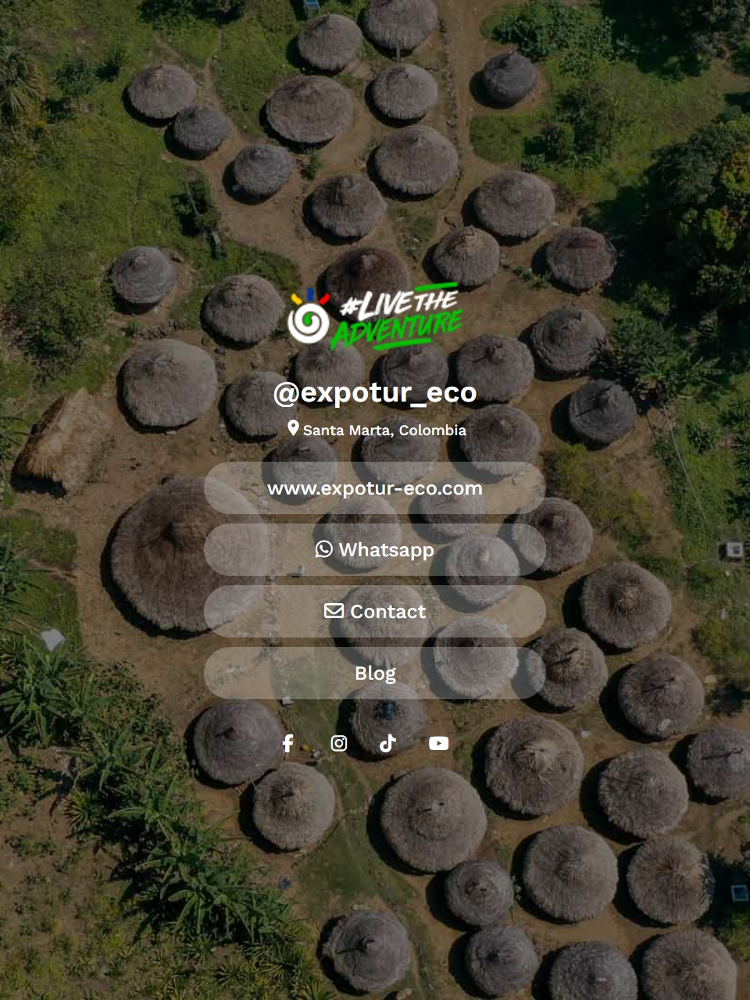

<h1 align="left">Proyecto Expolanding</h1>

###

Desarrollo de Landing tipo beacons para Instagram

###

<h2 align="left">Desarrollado con la intención de agregar mas datos que ayuden a el posicionamiento de la web.</h2>

###

Al ser desarrollado directamente y no con empresas de terceros se puede manipular el código a voluntad para agregar la meta data correspondiente y necesaria para la contribución al posicionamiento en Google

###

<h2 align="left">Desarrollado con:</h2>

###

  
  
  

###

  
  
  

###

